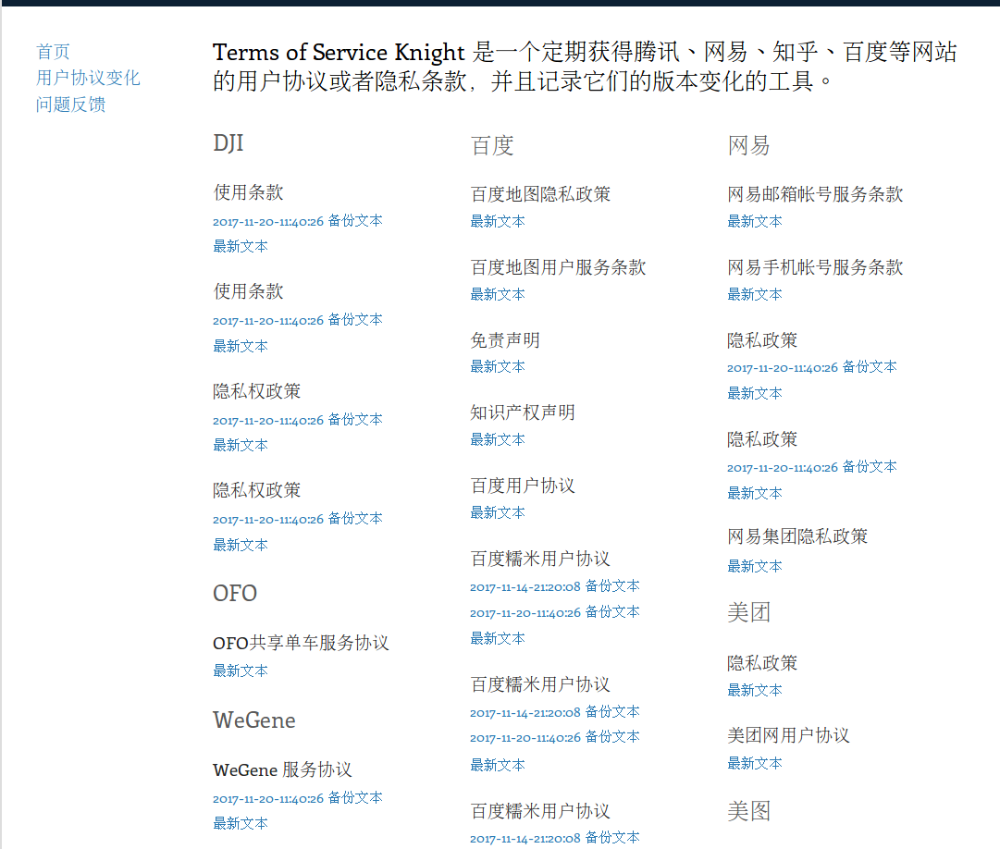
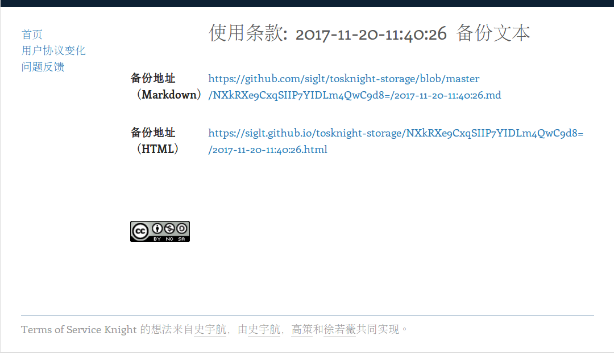

# [Terms of Service Knight](http://alpha.tosknight.org/)

## 功能

* 定期爬取腾讯、网易、知乎、百度等网站的用户协议（ http://www.qq.com/contract.shtml ）、隐私条款；
* 如果较之先前的版本有变化，保存新版的协议内容，并对变化内容进行比较；
* 可以添加需要跟踪的网站页面；
* 可能会考虑链接可信时间戳的API（TODO）

## 界面展示

    
    

## 架构与实现

Tosknight 共有三个组件组成：分别是 [CLI][1]，[storage][2] 和 [UI][3]。

[Tosknight CLI][1] 是一个命令行工具，在使用的时候需要指定两个参数，分别是 `source.yml` 的位置和 Tosknight storage 目录所在的位置。CLI 会通过 [colly](https://github.com/gocolly/colly) 爬取 [source.yml](./source.yml) 中的所有用户协议。随后使用 [html2text](https://github.com/Alir3z4/html2text/) 输出内容，使用 Unix 内置 diff 判断文件修改，如果修改则会保存修改版本。同时在这个过程中同样会保存一些元信息，为之后的 UI 展示做准备。

[Tosknight storage][2] 是存储历史版本的 repo，其之所以存在，是由于 Tosknight 并无任何服务器支持。

[Tosknight UI][3] 是一个生成 Tosknight 静态 UI 的工具。其根据 [Tosknight storage][2] 生成静态的页面，即 [http://alpha.tosknight.org/](http://alpha.tosknight.org/)。

从完整的生命周期来看，[Tosknight CLI][1] 会由 Cron 任务定期触发，更新 [Tosknight storage][2] 并且更新 [Tosknight UI][3]，是一个链式的过程。

## TODO

- 目前暂不支持在线的内容变更比较，可以使用 GitHub 的支持暂时替代，但这不是最好的解决方案，可以尝试使用 [diff2html](https://github.com/rtfpessoa/diff2html) 渲染输出

## 相关项目

* https://tosdr.org/index.html https://github.com/tosdr/tosdr.org
* https://github.com/ecprice/newsdiffs

## LICENSE

GPLv3

[1]: https://github.com/siglt/tosknight
[2]: https://github.com/siglt/tosknight-storage
[3]: https://github.com/siglt/tosknight-ui
